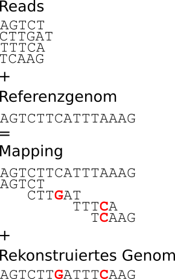
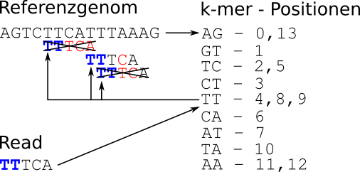

# Mapping

In dieser Aufgabe beginnen wir uns anzuschauen, wie Genome auch ohne für ein komplettes de novo-Assembly ausreichende Daten rekonstruiert werden könne.

Versuchen Sie zunächst, mit Ihrem Assembler die Datei "data/fluA_reads.fasta" zu assemblieren. Gelingt es Ihnen, eine k-mer-Länge zu finden, bei der Sie das komplette Genom assemblieren können? Falls ja, welche ist das? Falls nein, haben Sie eine Vermutung, warum nicht?

## Mapping-Konzept

Auf jeden Fall ist das Assembly dieser Reads schon deutlich schwieriger, als das der virus_perfectreads.fasta aus der letzten Aufgabe. In solch einem Fall kann man sich eines Referenzgenoms bedienen: Anstatt das komplette Genom mittels de novo-Assembly zu rekonstruieren, werden Ähnlichkeiten und Unterschiede zwischen den Reads und der Referenzsequenz identifiziert. Dabei lautet die Grundannahme: _"Die Reads stammen aus einem Genom, das dem Referenzgenom sehr ähnlich ist"_ - entsprechend kann das Genom, aus dem die Reads stammen, rekonstruiert werden, indem die Reads mit dem Referenzgenom verglichen werden und die Unterschiede zwischen den Reads und dem Referenzgenom in das Referenzgenom übertragen werden (weshalb in diesem Beispiel ein Assembly nicht klappen würde, müsste einfach erkennbar sein, wenn man sich die Überlappungen zwischen den Reads anschaut):



## Umsetzungsmöglichkeiten

Die dafür notwendige Zuordnung der Reads zu der korrekten Stelle im Genom ist allerdings nicht trivial. Ein Überblick der unterschiedlichen gängigen Herangehensweisen ist in dem Paper ["Mapping Reads on a Genomic Sequence: An Algorithmic Overview and a Practical Comparative Analysis" von Schbath et al.](https://www.ncbi.nlm.nih.gov/pmc/articles/PMC3375638/) zu finden. Wir befassen uns hier nur mit zwei Varianten.

### Triviale Lösung

Die triviale Lösung wäre, jeden Read an jeder Position mit dem Referenzgenom zu vergleichen, um die Position zu finden, an der er sehr gut (also mit nur wenigen mismatches - Basen, die sich von der Referenzsequenz unterscheiden - passt). Dies wäre allerdings bei großen Datensätzen - Sie erinnern sich, Genome können Milliarden von Basen lang sein, und NGS-Datensätze können hunderte Millionen Reads enthalten - prohibitiv aufwändig.

### Seed and extend

Eine effizientere Alternative ist der seed-and-extend-Algorithmus. Dabei wird zunächst eine Liste der k-mere in dem Referenzgenom sowie der Positionen, an denen sie auftauchen, erstellt. Dann wird für das erste k-mer in jedem Read überprüft, ob es im Referenzgenom vorkommt. Falls nein, wird der Read verworfen. Falls ja, wird dieses k-mer mit seiner Position als Startpunkt, der sogenannte seed, verwendet. Von diesem seed ausgehend wird überprüft, ob der Read an dieser Stelle ausreichend gut zum Referenzgenom passt. Dadurch wird die Anzahl an Positionen, an denen der Vergleich von Read und Referenzgenom stattfinden muss, drastisch reduziert. Ein Nachteil dieser Herangehensweise ist allerdings, dass mismatches am Anfang des Reads, also im seed, dazu führen, dass der Read nicht mehr zugeordnet werden kann.

Nach dieser Vorgehensweise würde das Mapping des 3. Reads aus dem obigen Beispiel mit seed-Länge 2 und einer maximalen Mismatch-Anzahl von 1 wie folgt ablaufen:



Zunächst wird das Referenzgenom in 2-mere zerlegt und für jedes 2-mer wird gespeichert, an welchen Positionen im Genom es vorkommt. Dann wird der Read an jeder Position, an der sein erstes 2-mer (TT) vorkommt (4, 8 und 9), mit der Referenz verglichen. An zwei dieser Positionen - 4 und 9 - hat der Read mehr als 1 Unterschied zur Referenzsequenz, diese Positionen werden also verworfen. Nur Position 8 erfüllt alle Kriterien, entsprechend wird diese als Mapping-Position des Reads gespeichert.

Wie Sie erkennen können, wenn Sie diesen Prozess auch mit Read 4 durchführen, funktioniert das Mapping mit dieser Methode nicht, wenn ein Unterschied zum Referenzgenom im seed vorkommt.

## Implementation

Implementieren Sie mit diesem Wissen das Mapping mittels seed-and-extend. Implementieren Sie dafür folgende Klassen und Methoden:

### Sequence

Da Sie diesmal sowohl Reads als auch eine Referenzsequenz aus einer FASTA-Datei lesen werden, werden Sie zwei Klassen mit gemeinsamer Funktionalität haben. Implementieren Sie also zunächst die Basisklasse Sequence mit den folgenden Methoden:

* ```__init__(self, lines)```: Constructor, wie in Read aus dem Assembler. Denken Sie dabei allerdings daran, dass FASTA-Dateien nach einer Header-Zeile beliebig viele Sequenzzeilen haben können (wie es beispielsweise in "data/fluA.fasta" der Fall ist).
* ```__str__(self)```: Wie in Read aus dem Assembler, gibt eine String-Repräsentation des Reads zurück: "<Readname>: <Erste max. 20 Basen der Readsequenz>..."
* ```__repr__(self)```: Wie in Read aus dem Assembler, gibt die von ```__str__``` definierte String-Repräsentation zurück.

### Read

Die Klasse ```Read``` erbt von ```Sequence``` und implementiert eine zusätzliche Methode:

* ```get_seed(self, seedlength)```: Gibt den seed des Reads mit der Länge ```seedlength``` zurück.

### Referenze

Die Klasse ```Reference``` erbt von ```Sequence``` und implementiert zudem die folgenden drei Methoden:

* ```calculate_kmers(self, kmersize)```: Berechnet die Liste aller k-mere der Länge ```kmersize``` und ihre Positionen. 
* ```get_kmer_positions(self, kmer)```: Gibt die Positionen zurück, an denen das k-mer ```kmer``` in der Sequenz vorkommt.  
* ```count_mismatches(self, read, position)```: Gibt zurück, wie viele mismatches es zwischen dem Read ```read``` (als ```Read```-Objekt übergeben, nicht als string) und der Sequenz an der Position ```position``` gibt. Ragt der Read über die Sequenz hinaus (z.B. wie wenn in dem oberen Beispiel die Anzahl der mismatches zwischen dem 1. Read und dem Referenzgenom an Position 13 berechnet werden sollte), werden alle Basen des Reads die über das Referenzgenom hinausragen als mismatches gezählt.

### Mapping

Die Klasse ```Mapping``` speichert ein Mapping-Ergebnis. Sie hat folgende Methoden:

* ```__init__(self, reference)```: Der Constructor, der die Referenzsequenz bekommt, auf die gemappt wird.
* ```add_read(self, read, position)```: Fügt dem Mapping an der Position ```position``` den Read ```read``` hinzu.
* ```get_reads_at_position(self, position)```: Gibt die Liste der an der Position ```position``` mappenden Reads zurück (also der Reads, deren Mapping an dieser Position beginnt, und nicht aller Reads, die an dieser Position eine Base haben - im obigen Beispiel würde also die Liste der an Position 3 mappenden Reads nur aus Read 2 bestehen, _nicht_ aus Read 1 und Read 2).

### Top-level-Funktionen

Implementieren Sie zudem zwei top-level-Funktionen: 

#### read_fasta

Die Funktion ```read_fasta(fastafile, klassname)``` soll die fasta-Datei ```fastafile``` einlesen und die Sequenzen in einer Liste von Objekten des Typs ```klassname``` zurückgeben. Dadurch können Sie diese Funktion sowohl für das Einlesen der ```Read```s als auch der ```Reference``` verwenden. Dafür können Sie die von ```globals()``` zurückgegebene dictionary verwenden. Diese enthält neben anderen nützlichen Informationen für jeden Klassennamen den Constructor - und da Funktionen (inklusive Constructoren) wie Sie sich vielleicht erinnern können in Python first-class citizens sind, können sie wie jede andere Variable verwendet werden:

```python
class ClassA:
  def __init__(self, text):
    self.text = text
 
  def say_hello(self):
    print("Hello, I am a " + self.text)


class ClassB:
  def __init__(self, text):
    self.text = text
 
  def say_hello(self):
    print("Go away, I hate " + self.text + "s!")


constructor_a = globals()["ClassA"]
a_instance = constructor_a("Banana")
constructor_b = globals()["ClassB"]
b_instance = constructor_b("Banana")
a_instance.say_hello()
b_instance.say_hello()
```

Sie können auf den Namen einer Klasse über das statische Attribut ```__name__``` zugreifen:

```python
class ClassA:
  def __init__(self, text):
    self.text = text
 
  def say_hello(self):
    print("Hello, I am a " + self.text)


print("Name of class: " + ClassA.__name__)
constructor_a = globals()[ClassA.__name__]
a_instance = constructor_a("Pineapple")
a_instance.say_hello()
```

#### map_reads

Die Funktion ```map_reads(reads, reference, kmersize, max_mismatches)``` soll die ```Read```s aus der Liste ```reads``` auf die ```Reference``` aus ```reference``` unter Verwendung der seed-Länge ```kmersize``` und einer Maximal-mismatch-Anzahl von ```max_mismatches``` mappen und das resultierende ```Mapping```-Objekt zurückgeben. 

In der nächsten Woche kümmern wir uns dann um eine Ausgabe in einem Standard-Format und die Visualisierung der Mapping-Ergebnisse.