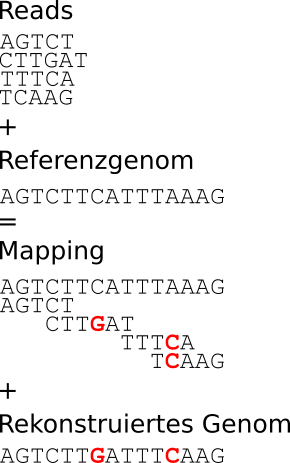
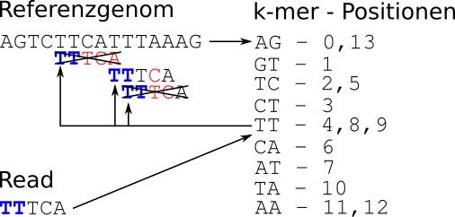

# Mapping

In this task, we will begin looking at how to reconstruct a genome even when there is not enough data for a complete de novo assembly.

First, try to assemble the reads in the file "data/fluA_reads.fasta" with your de novo assembler. Can you find a k-mer length that allows you to reconstruct the entire genome in a single contig? If so, what is that k-mer length? If not, then why do you think that is?

## Mapping-Konzept

In any case the assembly of those reads is much harder than it as been with the higher-coverage virus_perfectreads.fasta. In such a case, a reference genome can be used as a guide for the genome reconstruction: Instead of fully reconstructing the genome from the reads, differences and similarities between the reads in the dataset and a reference genome are identified. In order for this to work, the following assumption needs to hold: _"The reads come from a genome that is very similar to the reference genome"_. If that is true, then the sequenced genome can be reconstructed by simply identifying differences between the reads and the reference genome and applying these differences to the reference genome, as shown in this example (why a de novo assembly would fail here should be obvious from looking at the lengths of the overlaps between the reads):



## Mapping approaches

In order for this to work, the reads have to be assigned to their correct position in the reference genome. This, however, is not entirely trivial. A short overview of typical approaches is given in the paper ["Mapping Reads on a Genomic Sequence: An Algorithmic Overview and a Practical Comparative Analysis" von Schbath et al.](https://www.ncbi.nlm.nih.gov/pmc/articles/PMC3375638/). Here, we are only going to look at two of these options.

### Trivial solution

The trivial solution is comparing each read to every position in the reference genome and thus finding the position where it fits best. This, however, would need massive amounts of CPU power given the size of the datasets we are working with - you might recall that NGS datasets can comprise hundreds of millions of reads.

### Seed and extend

The seed and extend algorithm is a much more efficient alternative. Here, the first step is "indexing" the genome (a bit like what BLAST does): A dictionary of all k-mers in the reference genome and their positions in the reference genome is created. This is used to quickly create hypotheses on where a read could potentially be present in the reference genome. For each read, the first k-mer is checked against that index dictionary. If that k-mer does not occur in the index, then it is assumed that the read is not present in the reference genome and it is discarded. If the k-mer is present in the index, then each of these positions is used as a starting point ("seed") for a more thorough comparison: The read and the reference genome are compared base by base starting at the seed position and the number of differences between the reed and the reference genome is calculated. If the number of differences is low enough (what constitutes "low enough" is a parameter of the mapping algorithm), then it is assumed that this is the correct position for the read in the reference genome. This drastically reduces the number of comparisons that need to be performed. This however comes with the disadvantage that mismatches in the seed region of a read automatically make it impossible to map it to the reference.

The following example shows what mapping the 3rd read from the above example to the reference genome would look like with a seed length of 2 and a mismatch cutoff (the parameter for "low enough number of differences") of 1 would look like:



First, the reference genome is cut up into k-mers of length 2 and for each of these k-mers, the list of positions in the reference genome where it occurs is saved. Then, the read is compared to the reference genome at each position where its first 2-mer (TT) occurs in the reference genome (positions 4, 8 and 9). At two of these positions - 4 and 9 - the read differs from the reference at more than the maximum of 1, and thus these positions are discarded. Only position 8 satisfies all requirements for a correct mapping, and thus this is accepted as the position of the read.

As you can see, this process would not work with the 4th read, as there is a mismatch in this read's seed.

## Implementation

With this knowledge, you can implement the basis of a seed-and-extend mapper with the following methods:

### Sequence

Since you will need classes to represent two types of sequences - reads and rthe reference genome - you will need two classes with shared functionality. Thus, you first need to implement a base class `Sequence` with the following methods:

* ```__init__(self, lines)```: Constructor, just as the `Read` constructor in the assembler. Please remember that a FASTA file can contain an arbitrary number of lines of sequence data following the header - this is the case in "data/fluA.fasta".
* ```__str__(self)```: Just as the same method in `Read` in the assembler task: Outputs a string representation of the sequence in the following format: "<Readname>: <First max. 20 Bases of the sequence>..."
* ```__repr__(self)```: returns the same as ```__str__```.

### Read

The class `Read` extends `Sequence` and implements one additional method:

* ```get_seed(self, seedlength)```: returns the seed of the read with length `seedlength`.

### Reference

The class Reference` extends `Sequence` and implements the following three additional methods:

* `calculate_kmers(self, kmersize)`: Calculates the list of all k-mers of length `kmersize` and their positions. 
* `get_kmer_positions(self, kmer)`: Returns the positions at which the k-mer `kmer` occurs in the sequence.  
* `count_mismatches(self, read, position)`: Returns the number of mismatches between the read `read` (passed in as `Read` object, not as string) and the sequence at position `position`. If the read extends beyond the sequence (if `position` plus the length of the read sequence is larger than the length of the reference sequence), all bases that do not have a corresponding base in the reference sequence are counted as mismatches.

### Mapping

The class `Mapping` saves a mapping result. It has the following methods:

* `__init__(self, reference)```: The constructor. `reference` is the sequence that the mapping was performed to.
* `add_read(self, read, position)`: Adds the read `read` to the mapping at position `position`.
* `get_reads_at_position(self, position)`: Returns the list of all reads mapping to the reference at position `position` (i.e. all reads that were added at that position, not all reads who span that position).

### Top-level functions

Finally, please implement the following top-level functions:

#### read_fasta

DThe function `read_fasta(fastafile, klassname)` should read the file `fastafile` and return the sequences from this file as a list of objects of the type `klassname`. This allows you to use that function both for reading `Read`s and `Reference`s. To this end, you can use the `globals()` dictionary. This dictionary contains - in addition to other useful information - the constructor for each known classname. And since all functions and methods, as you might recall from the Python intro, are first-class citizens in Python, you can just use that constructor like any other method:

```python
class ClassA:
  def __init__(self, text):
    self.text = text
 
  def say_hello(self):
    print("Hello, I am a " + self.text)


class ClassB:
  def __init__(self, text):
    self.text = text
 
  def say_hello(self):
    print("Go away, I hate " + self.text + "s!")


constructor_a = globals()["ClassA"]
a_instance = constructor_a("Banana")
constructor_b = globals()["ClassB"]
b_instance = constructor_b("Banana")
a_instance.say_hello()
b_instance.say_hello()
```

You can access the name of a class using the static ```__name__``` attribute:

```python
class ClassA:
  def __init__(self, text):
    self.text = text
 
  def say_hello(self):
    print("Hello, I am a " + self.text)


print("Name of class: " + ClassA.__name__)
constructor_a = globals()[ClassA.__name__]
a_instance = constructor_a("Pineapple")
a_instance.say_hello()
```

#### map_reads

The function `map_reads(reads, reference, kmersize, max_mismatches)` should map all `Read`s  from the list `reads` to the `Reference` passed in as `reference` usind the seed length `kmersize` and a maximum mismatch number `max_mismatches`. It should return the resulting `Mapping` object. 

Next week, we will take a look at how to output the results in a standard format and how to visualize them.